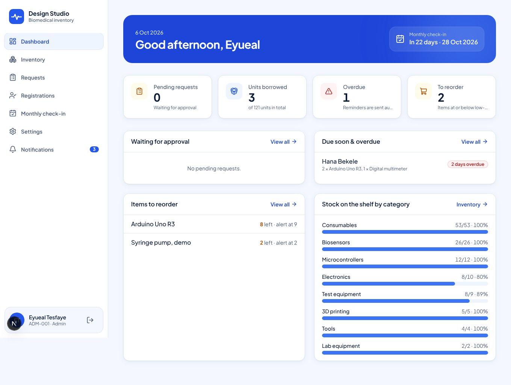
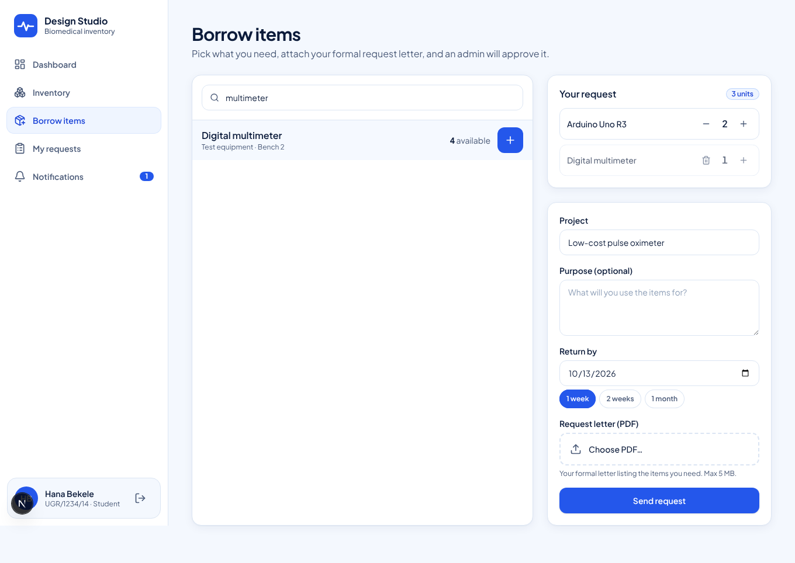
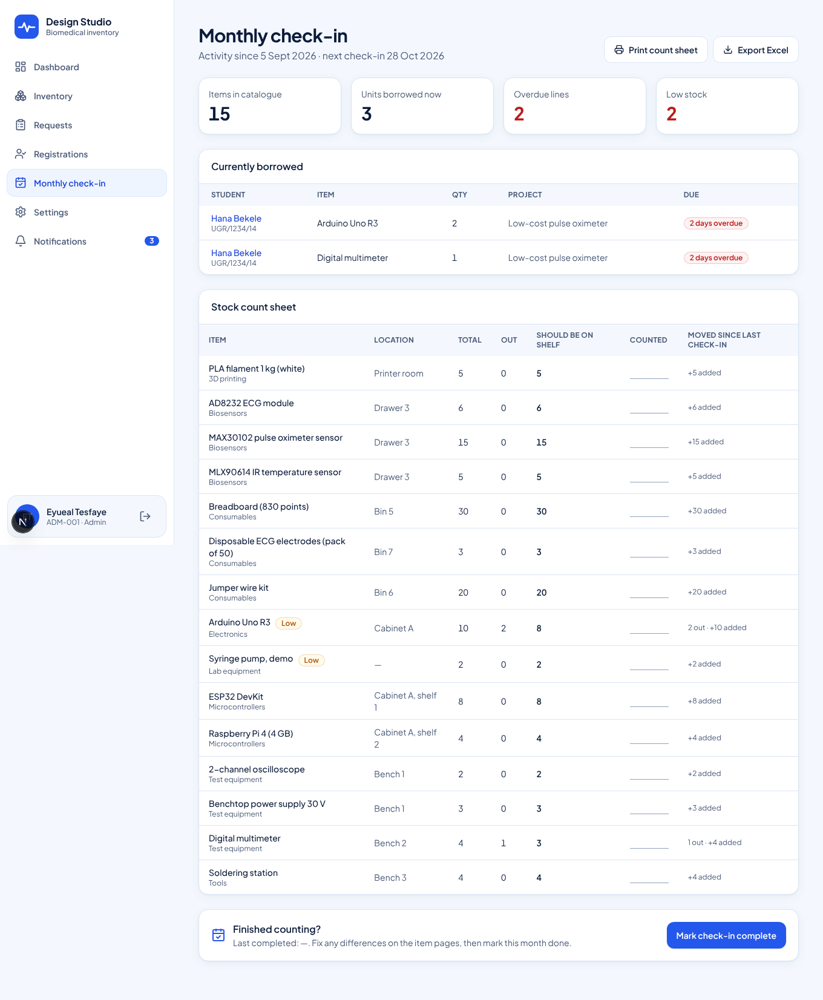

# Biomedical Design Studio — Inventory

A web app that replaces the paper / Excel tracking sheet for the studio's tools, components and supplies.

- **Inventory list** like your Excel sheet: search, filter by category, low-stock and "currently borrowed" views. Admins add/edit items, import from Excel/CSV (with a preview first) and export back to Excel.
- **Borrowing**: students pick items, set a return date, name the project and attach their **formal request letter (PDF)**. An admin approves or rejects it. Approval **deducts the stock automatically**; checking items back in adds them back (missing/broken units are removed from the total).
- **Monthly check-in**: one page with what is out, who has it, what is overdue, what should be on each shelf (printable count sheet) and what moved since the last check-in. Exports to Excel.
- **Alerts** (email + in-app):
  - Students: return date is near, overdue (weekly), request approved/rejected, account approved.
  - Admins: daily digest of near-due/overdue borrowers, monthly check-in coming up, **items to reorder** when stock is low, new registrations and new requests.
- **Sign-up with approval**: students register with full name, student ID, email, department, year and a password. An admin approves them, then they sign in with **student ID + password**.
- Extras: QR label per item, stock movement history per item, "who has it now", dashboard with stock health by category, phone-friendly layout.

Built with Next.js (React) + Tailwind CSS, Supabase (Postgres, auth, file storage) and Resend for email.

## Screenshots

| Admin dashboard | Borrowing | Monthly check-in |
| --- | --- | --- |
|  |  |  |

## Run it locally

Requirements: Node 20+, Docker (for the local Supabase).

```bash
npm install
npx supabase start          # starts Postgres/Auth/Storage, applies supabase/migrations, loads seed.sql
cp .env.example .env.local  # paste the URL, anon key and service_role key printed by the command above
npm run dev                 # http://localhost:3000
```

Without `RESEND_API_KEY`, emails are printed to the terminal instead of being sent.

## Going live

1. **Create a Supabase project** (free tier is fine) at <https://supabase.com>.
2. **Create the database**: open *SQL Editor*, paste the whole of `supabase/migrations/0001_init.sql` and run it
   (or `npx supabase link` then `npx supabase db push`).
3. In Supabase *Authentication → Providers → Email*, turn **off** "Confirm email" (admins approve accounts instead) and set the minimum password length to 8.
4. **Email**: create a free account at <https://resend.com>, verify your sending domain and create an API key.
5. **Deploy** to Vercel: import this GitHub repo, then add the environment variables from `.env.example`
   (`NEXT_PUBLIC_SUPABASE_URL`, `NEXT_PUBLIC_SUPABASE_ANON_KEY`, `SUPABASE_SERVICE_ROLE_KEY`, `APP_URL`, `RESEND_API_KEY`, `EMAIL_FROM`, `CRON_SECRET`).
   `vercel.json` schedules the alert job every day at 08:00 Addis Ababa time.
6. **Make the first admins**: both of you register on the site, then run this once in the Supabase SQL Editor
   (use your own student IDs, in capitals):

   ```sql
   update profiles set role = 'admin', status = 'approved'
   where student_id in ('YOUR-ID', 'OTHER-ADMIN-ID');
   ```

   After that, admins approve everyone else from the **Registrations** page (and can make other admins there).
7. **Import your inventory**: *Inventory → Import*, upload your Excel sheet. The first row needs headers; `Name` and `Quantity` are required,
   and `Category`, `Code`, `Location`, `Condition`, `Low stock`, `Notes` are optional. Use *Download template* for an example.

## How stock is kept correct

All stock changes happen inside database functions (`approve_request`, `return_request`, `set_item_total`) that lock the item rows,
so two admins approving at the same time can't push stock below zero. Every change is written to `stock_movements`,
which feeds the item history and the monthly check-in. Row-level security means students only see their own requests
and letters; only admins can change items, approve requests or see other students.

## Project layout

```
supabase/migrations/0001_init.sql   database tables, security rules and stock functions
supabase/seed.sql                   sample items for local development
src/app/(auth)/                     sign in, register
src/app/(app)/dashboard             admin + student dashboards
src/app/(app)/inventory             list, add/edit, item page (QR, history), Excel import
src/app/(app)/requests              borrow flow, approval, check-in of returns
src/app/(app)/registrations         approve students, manage admins
src/app/(app)/checkin               monthly check-in report
src/app/api/cron/alerts             daily reminder / low-stock job
src/app/api/export/[kind]           Excel exports
src/lib/                            auth, alerts, email, Excel, dates
```

## Later: SMS

Alerts go through `notify()` in `src/lib/notify.ts`. To add SMS (e.g. Africa's Talking or Twilio), add a phone number
to the sign-up form and `profiles`, then send the same notice from `notify()`.
